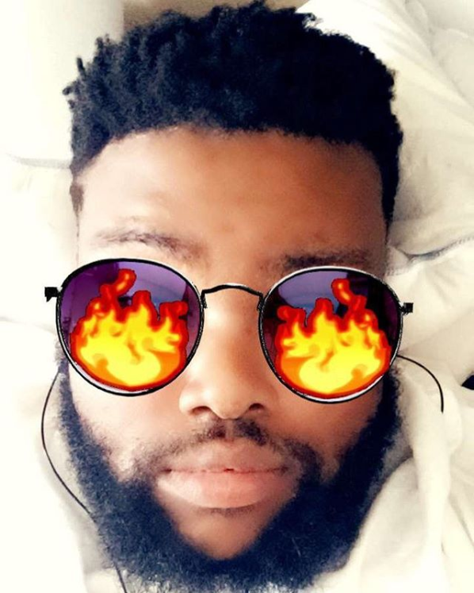
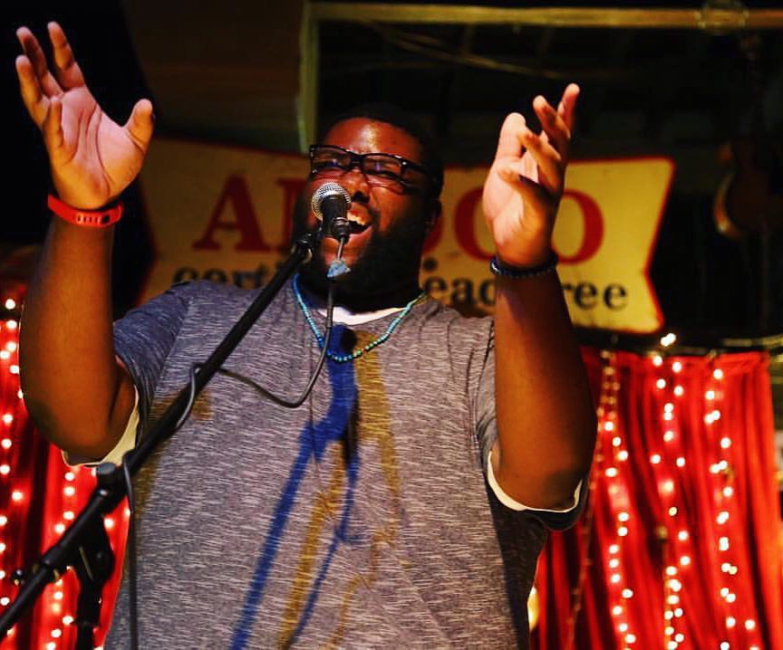

# Welcome to Willie's World

A computer science major who is looking to put the "art" in college of arts and science. I believe that creativity is the greatest assest of 
the human race and I want to bring that creativity and love for art into my work in the future. I am looking for an oppurtunity to further my education in a professional setting and get first hand experience in the field. 
# Stats
I am a junior at the university of North Carolina at Greensboro. I also am the assitant artistic director of the non-profit organization Authoring Action. 2 self published book of poems, a poem in an upcoming anthology, a movie and a play that were featured at the National Black theater festival, and countless java program homework assignments under my belt. 
# Resume

[Resume](https://github.com/WillieWrites/WillieWrites.github.io/raw/master/Resume.pdf) 

# A peek into some of my coding assingments

[Work](https://github.com/uncg-csc230-spring-2019-classroom-2/programming-assignment-5-lavon5203/blob/master/Question%201)

[More Work](https://github.com/uncg-csc230-spring-2019-classroom-2/programming-assignment-4-lavon5203/blob/master/WLHBigRational.java)

# The Hard Sell

I am a student looking for an oppurtunity to hone my craft and continue to learn and grow in a field that I have loved since the first time I sat in front of a computer to play tetris. Help me on my journey, you will not regret it. Looking forward to hearing from you. 

# Keep in touch

Email- wlholmes@uncg.edu

Twitter-Willie_Writes

Instagram-WillieWrites

